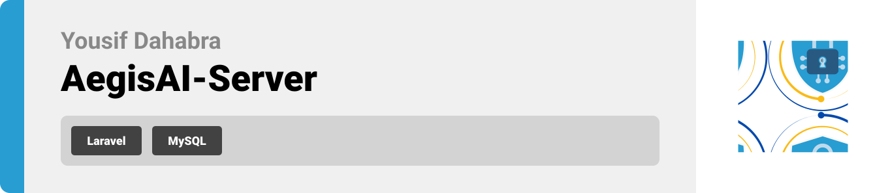
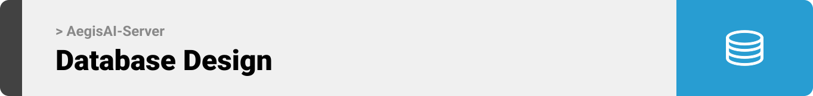
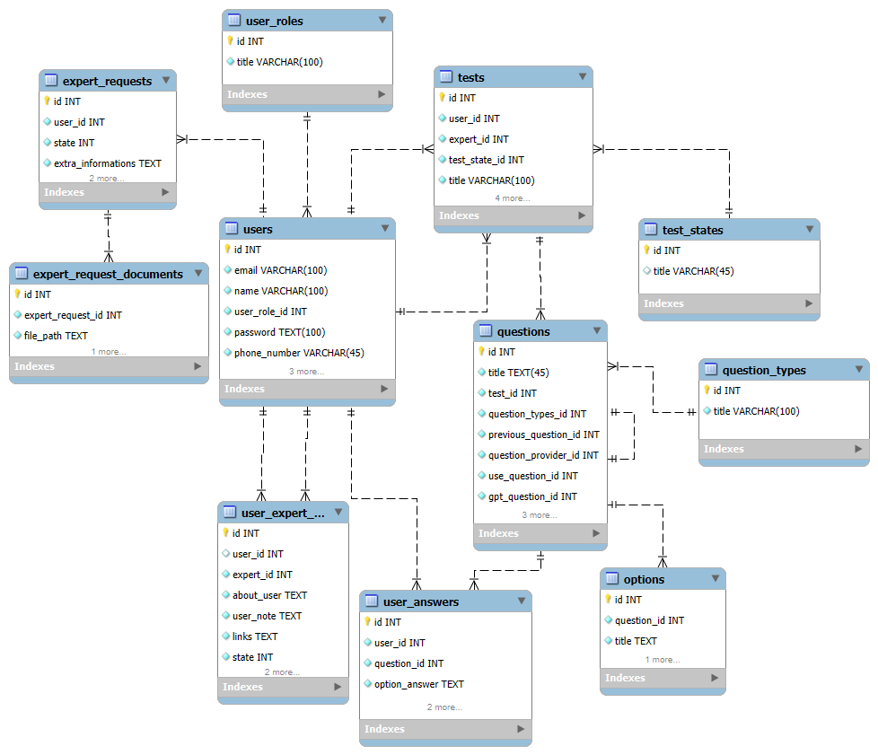

<br><br>

<!-- project philosophy -->


>  AegisAI embodies a user-focused approach, combining advanced backend architecture with Laravel's robust capabilities to ensure secure, scalable, and efficient operations. From implementing clean code principles like SRP to delivering a seamless API for communication, the project integrates modern web technologies to create an intuitive, interactive platform for online safety.

<br>
<!-- Implemented Laravel Features -->


>These features together make the backend robust, secure, and efficient

## Implemented Laravel Features

### **1. Single Responsibility Principle (SRP)**
Laravel's clean architecture promotes SRP by dividing the application into controllers, models, and services. This ensures maintainability and scalability, making the project easy to debug and extend as new features are added.

### **2. API Resource Transformations**
Used API resources to transform data consistently before sending responses. This ensures a standardized API output, improving integration with the frontend and mobile applications.

### **3. Middleware for Authentication and Authorization**
Implemented middleware to manage access control and secure API endpoints. This ensures only authorized users and experts can access sensitive data, reinforcing security and trust.

### **4. Form Requests for Validation**
Centralized validation logic using Laravel's form requests. This promotes reusability and keeps controllers clean, ensuring robust input validation for secure and reliable operations.


### **5. Dependency Injection with Service Containers**
Utilized Laravel's service container to implement dependency injection. This allows for clean management of services and dependencies, such as CRUD operations in service classes.

### **6. Database Migrations and Seeding**
Managed schema evolution through migrations and seeded the database with test data. This allows smooth development and deployment processes while maintaining data integrity.

### **7. Eloquent Relationships**
Leveraged Laravel's Eloquent ORM to define relationships between models, enabling efficient querying and minimizing database overhead. This simplifies handling complex data structures, such as user-expert interactions and test details.

### **8. Error and Exception Handling**
Implemented comprehensive error handling, returning user-friendly messages for invalid requests while logging details for debugging. This approach enhances the user experience and simplifies issue resolution.

<br><br>
<!-- UI UX -->


> Below is the streamlined folder structure for **AegisAI Server (Laravel)**. Key directories are expanded, while lesser-used subfolders are mentioned without detailing their contents.
```plaintext
.
├── .env.example               # Example environment configuration
├── composer.json              # Composer dependencies│
├── app                        # Core application logic
│   ├── Http                   # Handles HTTP requests and responses
│   │   ├── Controllers        # Manages application logic
│   │   ├── Middleware         # Request filtering and processing
│   │   ├── Requests           # Input validation rules
│   │   └── Resources          # API response formatting
│   ├── Models                 # Eloquent ORM data models
│   ├── Providers              # Registers services and bindings
│   └── Services               # Encapsulates business logic
│
├── bootstrap                  # Laravel bootstrapping files
│   └── cache                  # Cache configurations
│
├── config                     # Configuration files
│   ├── auth.php               # Authentication setup
│   ├── database.php           # Database connection details
│   └── services.php           # External service integrations
│
├── database                   # Database migrations and seeders
│   ├── migrations             # Defines database schema
│   ├── seeders                # Populates test and default data
│   └── factories              # Generates model test data
│
├── routes                     # Route definitions
│   ├── api.php                # API routes
│
├── storage                    # Local file storage
│   ├── app                    # Application-specific files
│   ├── framework              # Framework-specific storage
│   └── logs                   # Application logs
└── vendor                     # Composer-managed dependencies
```
This structure showcases a clean and organized Laravel project, designed for scalability, maintainability, and ease of collaboration.


 

<br><br>

<!-- Database Design -->


###  Leveraging [MySQL Workbench](https://www.mysql.com/products/workbench/), I crafted and implemented a robust, expertly designed database architecture to power seamless functionality.
| Database Diagram |
| --- |
|  |


<br><br>
 


<!-- Prompt Engineering -->


###  Mastering AI Interaction: Unveiling the Power of Prompt Engineering:

- This project uses advanced prompt engineering techniques to optimize the interaction with natural language processing models. By skillfully crafting input instructions, we tailor the behavior of the models to achieve precise and efficient language understanding and generation for various tasks and preferences.

<br><br>

<!-- AWS Deployment -->
<!-- 

###  Efficient AI Deployment: Unleashing the Potential with AWS Integration:

- This project leverages AWS deployment strategies to seamlessly integrate and deploy natural language processing models. With a focus on scalability, reliability, and performance, we ensure that AI applications powered by these models deliver robust and responsive solutions for diverse use cases.

<br><br> -->

